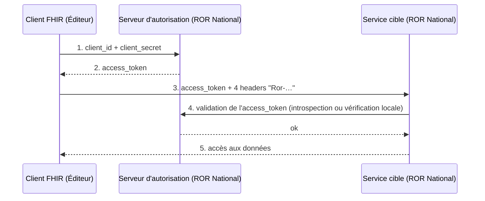
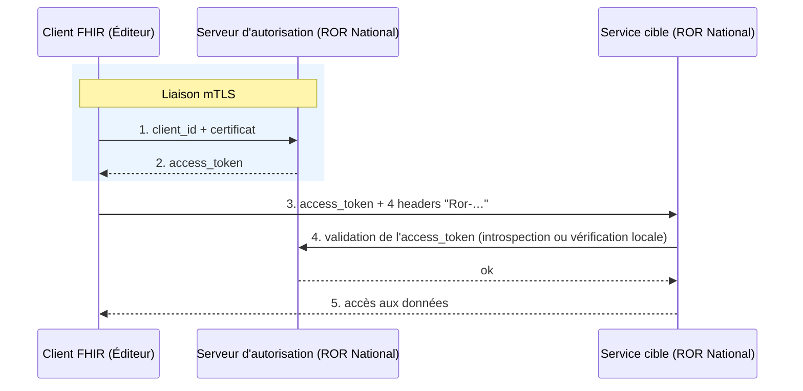

Le mode d'authentification à mettre en œuvre dépend du [profil d'accès aux données]({{ '/pages/guide/acces-donnees/vue-ensemble.html' | relative_url }}) affecté à l'éditeur lors de l'intégration.

## L'authentification pour les profils 0 (accès aux données publiques)

Les profils 0 d'accès aux données (accès uniquement aux données publiques) s'authentifient avec un `client_id` / `client_secret` avec le protocole **OAuth2** (RFC 6749).

Ce sont les seuls à pouvoir s'authentifier avec un `client_secret`. Les autres profils doivent s'authentifier avec un certificat (voir ci-dessous).

L'URL de l'`access_token` endpoint est décrite sur la page [Environnements et endpoints]({{ '/pages/guide/acces-donnees/environnements-endpoints.html' | relative_url }}).

## L'authentification pour les autres profils (accès aux données restreintes et très restreintes)

Pour tous les autres profils d'accès aux données (de 1 à 4), l'authentification mise en place est **OAuth2 avec mTLS** (RFC 6749 + RFC 8705) :

- La liaison mTLS est établie entre le client FHIR et le serveur d'autorisation ;
- Le client FHIR accédant à la donnée sensible (accès aux données restreintes et/ou très restreintes) n'a pas de `client_secret` mais un certificat qui remplace le `client_secret`.

### Flux 1 et 2 : obtention du token

Le client FHIR s'authentifie via une liaison mTLS auprès du serveur d'autorisation du ROR avec un `client_id` ; le certificat utilisé dans la liaison mTLS remplace le `client_secret`.

- Sur l'environnement « bac-à-sable », le certificat doit être un certificat issu d'**IGC SANTE test**.
- Sur la production, le certificat doit être un certificat issu d'**IGC SANTE**.

### Flux 3 à 5 : consommation de l'API

Le client FHIR se connecte au service cible du ROR en HTTPS. Voir la page [Consommation des API FHIR]({{ '/pages/guide/acces-donnees/consommation-api.html' | relative_url }}).

Voir la page [Exemple cURL complet]({{ '/pages/guide/acces-donnees/exemple-curl.html' | relative_url }}) pour des exemples complets, ainsi que les instructions de conversion d'un certificat `.p12` pour ces deux environnements.
